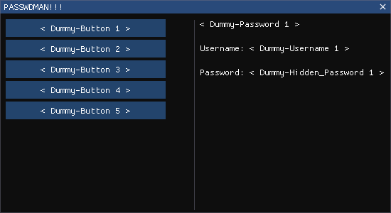

<h1 align="center"> <b>PasswdMan</b> </h1>

Simple password manager made in C/C++.

  <code>(current state)</code>

  

## Progress Updates
**Working on the GUI rn...** (and the password generation)

## 
**⚠️ TODO: ⚠️**
<!-- Some Goals for the Project. -->
- [ ] Password generation
- [ ] Password storing
- [ ] Encryption
- [ ] GUI using imGUI (I'm workin on it!!)
- [ ] Input Validation
- [ ] Master Password
